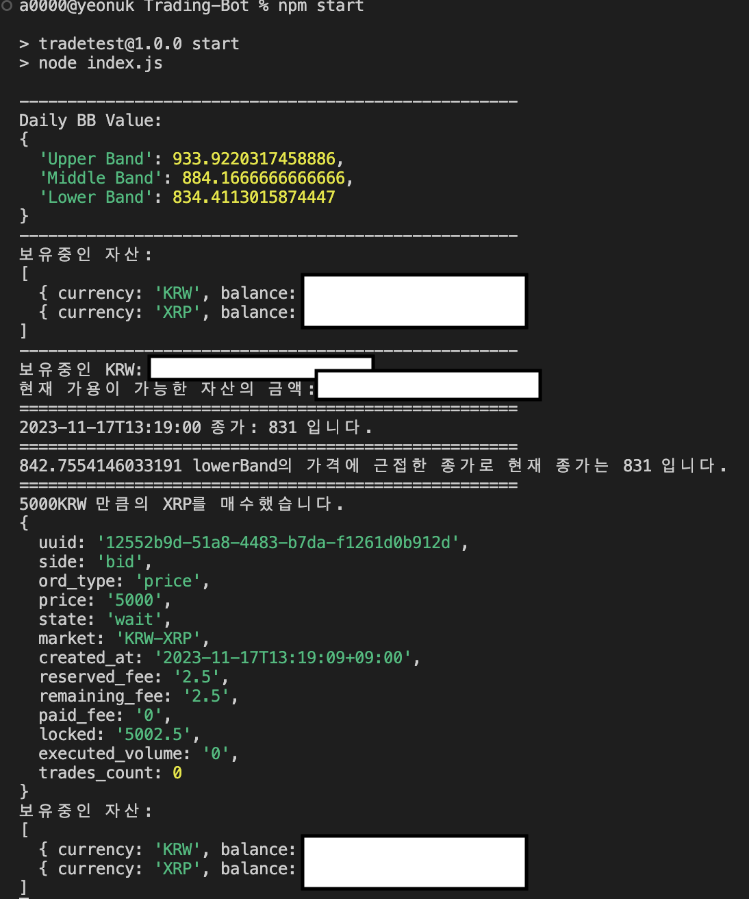

# Toy Project ;Auto Trading Bot(with.Upbit Open API)

:Prepare Toy Project:

## Summary

- Upbit Open API로 진행합니다.
- Bollinger Bands 기법을 로직으로 코드 작성
- 일별 캔들 정보 넣고 매매 범위 고정
- 주기적으로 분별 캔들 정보 조회 API Call
- Bollinger Bands 기법에 의거하여 자동으로 암호화폐 매매 수행
- 아래 사진은 **잘 동작하는 것을 확인**



## 자동 암호화폐 매매 봇 구현 1(with.Upbit Open API)

요즘 암호화폐의 가치가 꾸준히 상승장으로 이어지고 있습니다. 상승장에선 각자의 매매기법에 따라 트레이딩을 진행할 필요가 있습니다.
이번 시리즈에선 내가 계속 보지 않아도 코드에 작성된 로직에 따라 자동으로 매매를 진행해주는 트레이딩 봇을 만들어보겠습니다.

### 준비물

- 업비트 계정
- 본인의 IP 주소(보안 상 트레이딩 봇을 실행시킬 특정 IP 주소가 필요합니다)

### 내용

업비트 뿐만 아니라 거래소에서 제공하는 정보를 사용하기 위해선 해당 거래소에서 제공하는 Open API가 존재하는지 알고 있어야 합니다.
해당 글에선 Javascript를 사용하기에 Node.js의 프로젝트 매니저인 npm을 사용하겠습니다.

1. 먼저 업비트 공식 홈페이지에서 고객센터에 있는 OpenAPI 란으로 이동합니다. (참고: https://upbit.com/service_center/open_api_guide)
   이후 로그인을 해서 Open API 사용하기 이후 Open API Key 발급하기를 눌러 발급합니다. 이때 여러분이 트레이딩 봇에서 사용할 기술의 범위를 체크하여 발급합니다. 저는 다 체크해서 발급했습니다.
2. 프로젝트를 만듭니다.
   폴더를 만들고, 터미널을 통해 Node.js를 설치합니다.
   윈도우라면 공식 웹사이트(참고: https://nodejs.org/en) 에서 설치 프로그램 다운 후 진행하시면 되고, Mac이라면 Homebrew를 통해 brew install node 하시면 됩니다.
   Node.js가 설치되었다면 Node의 패키지 매니저인 npm을 통해 초기 프로젝트 세팅을 해줍니다.

```javascript
npm init -y // 간략 세팅 방법입니다.
```

3. OpenAPI 이용을 위한 라이브러리를 설치해줍니다.

```javascript
npm install request jsonwebtoken
```

4. 프로젝트에 index.js 파일을 만들고 "전체 계좌 조회" API 사용 예시를 업비트 개발자센터에서 불러옵니다.(참고: https://docs.upbit.com/reference/%EC%A0%84%EC%B2%B4-%EA%B3%84%EC%A2%8C-%EC%A1%B0%ED%9A%8C)
   불러온 코드

```javascript
const access_key = process.env.UPBIT_OPEN_API_ACCESS_KEY;
const secret_key = process.env.UPBIT_OPEN_API_SECRET_KEY;
const server_url = process.env.UPBIT_OPEN_API_SERVER_URL;
```

위와 같이 access_key, secret_key, server_url를 각각 Open API Key 발급받은 대로 입력해주어야 하는데 저의 경우 깃허브에 해당 프로젝트를 올려서 공유할 예정이기에 dependencies에 dotenv 라이브러리를 추가하여 .env 파일로 Key를 관리하고 있습니다.
저와 같이 관리하신다면 gitignore 파일에 .env는 변경사항에서 제외한다는 명령어를 추가해주어야 합니다. 상기의 키를 입력하고 $ node index.js 를 입력하면 잘 실행됩니다.

## 자동 암호화폐 매매 봇 구현 2(with.Upbit Open API)

이전 글에선 준비하는 과정 및 프로젝트 세팅까지 진행하였으니 이번 글에선 매매를 직접 진행해보겠습니다.

### 주문 API 사용 방법 (Upbit Open API)

Upbit의 주문 API는 사용자가 지정한 마켓에 대한 주문을 생성하고, 주문을 조회하는 데 사용됩니다. 주문을 생성할 때는 주문 종류(side), 주문량(volume), 주문 가격(price), 주문 타입(ord_type) 등을 지정해야 합니다.

### 주문 API 요청 구성

- URL: 주문 API의 엔드포인트는 /v1/orders입니다.
- Method: 주문을 생성할 때는 POST 메서드를 사용합니다.

### 주요 파라미터

- market (필수): 거래할 암호화폐의 마켓 ID를 지정합니다. 예를 들어, "KRW-BTC"는 한국 원화(KRW)로 비트코인(BTC)을 거래하는 마켓을 의미합니다.
- side (필수): 주문 종류를 나타내는 파라미터입니다.
- bid: 매수 주문 (Buy)
- ask: 매도 주문 (Sell)
- volume: 주문량을 나타냅니다. 매수 주문 시 필수입니다.
- price: 주문 가격을 나타냅니다. 지정가 주문(ord_type: limit) 또는 시장가 매수 주문(ord_type: price) 시 필수입니다.
- ord_type (필수): 주문 타입을 나타냅니다.
- limit: 지정가 주문
- price: 시장가 주문 (매수)
- market: 시장가 주문 (매도)
- identifier: 조회용 사용자 지정값으로 선택적으로 사용됩니다.

### 서명 생성

주문 API를 사용하기 위해서는 API 키 (access_key), API 시크릿 (secret_key)가 필요합니다.
API 요청에 대한 보안을 위해 서명(signature)을 생성해야 합니다.
access_key, nonce, query_hash, query_hash_alg를 조합하여 서명을 생성합니다.
서명은 JWT(JSON Web Token) 형식으로 생성되며, 요청의 Authorization 헤더에 포함됩니다.

### 참고 예시

```javascript
const request = require("request");
const uuidv4 = require("uuid/v4");
const crypto = require("crypto");
const sign = require("jsonwebtoken").sign;
const queryEncode = require("querystring").encode;
const dotenv = require("dotenv");
dotenv.config();

const access_key = process.env.UPBIT_OPEN_API_ACCESS_KEY;
const secret_key = process.env.UPBIT_OPEN_API_SECRET_KEY;
const server_url = process.env.UPBIT_OPEN_API_SERVER_URL;

/*
INFO:
Request Parameters
Name	설명	타입
market *	마켓 ID (필수)	String
side *	주문 종류 (필수)
- bid : 매수
- ask : 매도	String
volume *	주문량 (지정가, 시장가 매도 시 필수)	NumberString
price *	주문 가격. (지정가, 시장가 매수 시 필수)
ex) KRW-BTC 마켓에서 1BTC당 1,000 KRW로 거래할 경우, 값은 1000 이 된다.
ex) KRW-BTC 마켓에서 1BTC당 매도 1호가가 500 KRW 인 경우, 시장가 매수 시 값을 1000으로 세팅하면 2BTC가 매수된다.
(수수료가 존재하거나 매도 1호가의 수량에 따라 상이할 수 있음)	NumberString
ord_type *	주문 타입 (필수)
- limit : 지정가 주문
- price : 시장가 주문(매수)
- market : 시장가 주문(매도)	String
identifier	조회용 사용자 지정값 (선택)	String (Uniq 값 사용)
*/

const body = {
  market: "KRW-BTC",
  side: "bid",
  //   volume: "0.01",
  price: "5000",
  ord_type: "price",
};

const query = queryEncode(body);

const hash = crypto.createHash("sha512");
const queryHash = hash.update(query, "utf-8").digest("hex");

const payload = {
  access_key: access_key,
  nonce: uuidv4(),
  query_hash: queryHash,
  query_hash_alg: "SHA512",
};

const token = sign(payload, secret_key);

function orderCryptocurrency() {
  const options = {
    method: "POST",
    url: server_url + "/v1/orders",
    headers: { Authorization: `Bearer ${token}` },
    json: body,
  };

  return new Promise((resolve, reject) => {
    request(options, (error, response, body) => {
      if (error) {
        reject(error);
      } else {
        resolve(body);
      }
    });
  });
}

module.exports = {
  orderCryptocurrency,
};
```

### 주문 실행 함수

해당 코드에서는 Upbit Open API를 활용하여 주문을 실행하는 함수인 orderCryptocurrency를 정의하고 있습니다. 이 함수는 아래와 같은 기능을 수행합니다.

- 주문에 필요한 파라미터를 설정합니다.
- 파라미터를 이용하여 서명을 생성합니다.
- API 요청을 위한 옵션을 설정합니다.
- API 요청을 수행하고, 결과를 반환합니다.

### 해당 주문 실행 함수의 사용 예시

```javascript
const { orderCryptocurrency } = require("./path/to/orderCryptocurrency");

// 주문 실행
orderCryptocurrency()
  .then((result) => {
    console.log("주문 결과:", result);
  })
  .catch((error) => {
    console.error("주문 실패:", error);
  });
```

## 자동 암호화폐 매매 봇 구현 3(with.Upbit Open API)

이전 글에선 매매를 직접 수행하였으니 이번 글에선 볼린저밴드와 같은 투자 기법을 구현하기 위해 캔들 정보를 가져오고 값을 구하는 것을 진행해보겠습니다.

### 캔들 정보 조회 API

Upbit의 캔들 정보 조회 API는 특정 마켓의 캔들 정보를 가져올 수 있습니다. 이를 통해 트렌드 분석, 기술적 분석 등 다양한 목적으로 활용할 수 있습니다.

### 나의 코드

getDailyCandlesInfo 함수

```javascript
function getDailyCandlesInfo() {
  // API 요청 옵션 설정
  const options = {
    method: "GET",
    url: "https://api.upbit.com/v1/candles/days?count=30&market=KRW-BTC",
    headers: { accept: "application/json" },
  };

  // API 요청 및 응답 처리
  return new Promise((resolve, reject) => {
    request(options, (error, response, body) => {
      if (error) {
        reject(error);
      } else {
        try {
          // JSON 파싱
          const responseBody = JSON.parse(body);

          // 캔들의 거래 가격만 추출
          const tradePrices = responseBody.map((candle) => candle.trade_price);

          // 기술적 분석(Bollinger Bands)을 통한 값 계산
          const dailyBBValue = technicalBollingerBand.bb(tradePrices);

          // 결과 반환
          resolve(dailyBBValue);
        } catch (parseError) {
          reject(parseError);
        }
      }
    });
  });
}
```

상기의 코드는 KRW-BTC 마켓의 일별 캔들의 정보를 QS을 통해 요청하고 받아와 JSON형식으로 파싱하여 원하는 캔들의 종가 가격만을 추출하였습니다. 다음 글에서 사용될 Bollinger Bands의 함수에 삽입해 트레이딩의 기술적 분석 근거를 산출했습니다.
다음은 트레이딩을 위한 1분당 캔들 정보를 구하는 코드입니다.

getMinuteCandleInfo 함수

```javascript
function getMinuteCandleInfo() {
  // API 요청 옵션 설정
  const options = {
    method: "GET",
    url: "https://api.upbit.com/v1/candles/minutes/1?market=KRW-BTC&count=1",
    headers: { accept: "application/json" },
  };

  // API 요청 및 응답 처리
  return new Promise((resolve, reject) => {
    request(options, (error, response, body) => {
      if (error) {
        reject(error);
      } else {
        try {
          // JSON 파싱
          const responseBody = JSON.parse(body);

          // 캔들의 거래 가격만 추출
          const tradePrices = responseBody.map((candle) => candle.trade_price);

          // 결과 반환
          resolve(tradePrices);
        } catch (parseError) {
          reject(parseError);
        }
      }
    });
  });
}
```

위와 같이 작성된 코드를 사용하는 예시도 가져왔습니다.

### 사용 예시

```javascript
const { getDailyCandlesInfo, getMinuteCandleInfo } = require("./path/to/api");

// 일봉 캔들 정보 조회
getDailyCandlesInfo()
  .then((dailyBBValue) => {
    console.log("일봉 Bollinger Bands 값:", dailyBBValue);
  })
  .catch((error) => {
    console.error("일봉 캔들 정보 조회 실패:", error);
  });

// 1분봉 캔들 정보 조회
getMinuteCandleInfo()
  .then((tradePrices) => {
    console.log("1분봉 거래 가격:", tradePrices);
  })
  .catch((error) => {
    console.error("1분봉 캔들 정보 조회 실패:", error);
  });
```

## 자동 암호화폐 매매 봇 구현 4(with.Upbit Open API)

이전 글에선 캔들 정보를 가져오고 값을 구하는 것을 진행하였습니다. 이번 글에선 Bollinger Bands가 무엇인지 알아보고 해당 기술적 지표를 코드를 통해 직접 구현 해보겠습니다.

### Bollinger Bands 소개

볼린저 밴드는 존 볼린저(John Bollinger)가 개발한 기술적 분석 도구로, 금융 시장에서 추세, 변동성 및 잠재적인 반전 지점을 식별하는 데 사용되는 인기 있는 도구입니다.
이는 상중하 3개의 밴드로 구성되어 있으며, 중간 밴드는 단순 이동 평균이며 상단 및 하단 밴드는 중간 밴드에서의 표준 편차를 기반으로 계산됩니다.

### Bollinger Bands 이해하기

1. 중간 밴드
   중간 밴드는 단순 이동 평균(SMA)으로서 특정 기간 동안의 평균 가격을 나타냅니다.
2. 상단 및 하단 밴드
   상단 밴드: 중간 밴드와 표준 편차의 두 배를 더한 값으로 계산됩니다.
   하단 밴드: 중간 밴드에서 표준 편차의 두 배를 뺀 값으로 계산됩니다.
   이러한 밴드들은 중간 밴드를 중심으로 동적인 범위를 제공하며, 고변동성 기간에는 확장되고 저변동성 기간에는 축소됩니다.

### 차트의 기술적 지표를 코드로 구현하기

```javascript
function bb(tradePrices) {
  const period = 20;
  const movingAverages = [];

  // 이동 평균 계산
  for (let i = 0; i <= tradePrices.length - period; i++) {
    const average =
      tradePrices.slice(i, i + period).reduce((sum, price) => sum + price, 0) /
      period;
    movingAverages.push(average);
  }

  // 표준 편차 계산
  const standardDeviation = Math.sqrt(
    movingAverages.reduce(
      (sum, avg) => sum + Math.pow(avg - movingAverages[0], 2),
      0
    ) / period
  );

  // 볼린저 밴드 계산
  const upperBand = movingAverages[0] + 2 * standardDeviation;
  const middleBand = movingAverages[0];
  const lowerBand = movingAverages[0] - 2 * standardDeviation;

  // 결과를 객체로 저장
  const bollingerBands = {
    "상단 밴드": upperBand,
    "중간 밴드": middleBand,
    "하단 밴드": lowerBand,
  };

  return bollingerBands;
}

module.exports = {
  bb,
};
```

이 구현에서:
movingAverages 배열은 계산된 이동 평균을 저장합니다.
표준 편차는 이동 평균을 기반으로 계산됩니다.
상단 및 하단 밴드는 표준 편차를 사용하여 결정됩니다.

## 자동 암호화폐 매매 봇 구현 5(with.Upbit Open API)

이전 글에선 Bollinger Bands가 무엇인지 알아보고 해당 기술적 지표를 코드를 통해 직접 구현하였습니다. 이번 글에선 작성된 코드들에 대해 단계별 가이드를 준비했습니다.

### 1. 필수 모듈 설치

```javascript
npm install request
npm install uuid
npm install crypto
npm install jsonwebtoken
npm install querystring
npm install dotenv
```

### 2. API 키 및 시크릿 설정

Upbit Open API를 사용하기 위해 Upbit 개발자 센터에서 API 키와 시크릿을 발급받아 .env 파일에 저장하세요.

```javasciprt
UPBIT_OPEN_API_ACCESS_KEY=your_access_key
UPBIT_OPEN_API_SECRET_KEY=your_secret_key
UPBIT_OPEN_API_SERVER_URL=https://api.upbit.com
```

### 3. 필수 파일 및 모듈 로드

```javascript
const request = require("request");
const uuidv4 = require("uuid/v4");
const crypto = require("crypto");
const sign = require("jsonwebtoken").sign;
const queryEncode = require("querystring").encode;
const dotenv = require("dotenv");
const accountsInfo = require("./apis/assets");
const orderCryptocurrency = require("./apis/order");
const getCandlesInfo = require("./apis/ticker");

dotenv.config();
```

### 4. 필요한 함수 구현

findKRW 및 findBTC: KRW 및 BTC의 인덱스를 찾는 함수
fetchData: 데이터를 수집하고 매매 전략을 실행하는 메인 함수

해당 글의 개요의 첨부된 코드 저장소를 참고 부탁드립니다.

```javascript
async function findKRW() {
  // ...
}

async function findBTC() {
  // ...
}

async function fetchData() {
  try {
    // ...
  } catch (error) {
    console.error(error);
  }
}

fetchData();
```

### 5. 주기적인 API 호출 및 매매 전략 실행

```javascript
const minuteInterval = setInterval(async () => {
  // ...
}, 60000);
```

### 6. 매매 전략 구현

이 예제에서는 볼린저 밴드를 이용한 간단한 매매 전략을 사용합니다.

```javascript
if (minuteCandlePrice <= lowerBand * 1.05) {
  // 매수 주문 로직
} else if (minuteCandlePrice >= upperBand * 0.95) {
  // 매도 주문 로직
}
```

제가 작성한 자동 암호화폐 매매 봇 시리즈물을 정독하셨다면 어떤 투자 기술 지표를 활용했는지 알 수 있습니다.

### 7. 보완 및 추가 작업

이 프로젝트를 확장하려면 다음과 같은 작업을 고려할 수 있습니다.
전략 최적화: 현재 전략은 간단하게 구현되었지만, 더 복잡한 전략을 구현하여 수익을 극대화할 수 있습니다.

## 자동 암호화폐 매매 봇 구현 6(with.Upbit Open API)

이전 글에선 작성된 코드들에 대해 단계별 가이드를 준비했습니다. 이번 글에선 더 많은 암호화폐를 거래하기 위해 마켓의 정보를 조회하고 그 결과 값을 json 파일에 내보내는 것까지 진행해보겠습니다.

### 마켓 코드 조회

```javascript
const request = require("request");

const options = {
  method: "GET",
  url: "https://api.upbit.com/v1/market/all?isDetails=false",
  headers: { accept: "application/json" },
};

request(options, function (error, response, body) {
  if (error) throw new Error(error);

  console.log(body);
});
```

이렇게만 해도 불러와집니다. 그러나 저는 모듈화를 사용해 필요할 때만 사용되길 원하기 때문에 새롭게 market.js를 만들고 해당 함수를 내보낼 수 있는 형태로 만들고자 합니다.

### 나의 마켓코드 조회

```javascript
// market.js
const request = require("request");

function getMarketsInfo() {
  const options = {
    method: "GET",
    url: "https://api.upbit.com/v1/market/all?isDetails=false",
    headers: { accept: "application/json" },
  };

  return new Promise((resolve, reject) => {
    request(options, (error, response, body) => {
      if (error) {
        reject(error);
      } else {
        try {
          const responseBody = JSON.parse(body);
          resolve(responseBody);
        } catch (parseError) {
          reject(parseError);
        }
      }
    });
  });
}

module.exports = {
  getMarketsInfo,
};
```

이렇게 하면 해당 함수가 호출될 때 responseBody에서 선언한 대로 json의 형태로 결과를 출력해줍니다.

더 나아가 저는 json으로 파일을 생성해서 결과값을 내보내길 바라기에 이에 맞는 코드 수정을 해보겠습니다.

### JSON 파일 생성 코드

```javascript
const fs = require("fs");
const request = require("request");

function getMarketsInfo() {
  const options = {
    method: "GET",
    url: "https://api.upbit.com/v1/market/all?isDetails=false",
    headers: { accept: "application/json" },
  };

  return new Promise((resolve, reject) => {
    request(options, (error, response, body) => {
      if (error) {
        reject(error);
      } else {
        try {
          const responseBody = JSON.parse(body);

          // JSON 파일 생성
          fs.writeFileSync(
            "marketsInfo.json",
            JSON.stringify(responseBody, null, 2)
          );

          resolve(responseBody);
        } catch (parseError) {
          reject(parseError);
        }
      }
    });
  });
}

module.exports = {
  getMarketsInfo,
};
```

### 8. 마무리

이러한 단계를 참고하여 자동 매매 봇을 개발하면서 JavaScript 및 암호화폐 거래에 대한 이해를 높일 수 있을 것입니다. 부족한 부분은 이메일로 연락주시면 답변을 드리겠습니다. **고생하셨습니다.**
